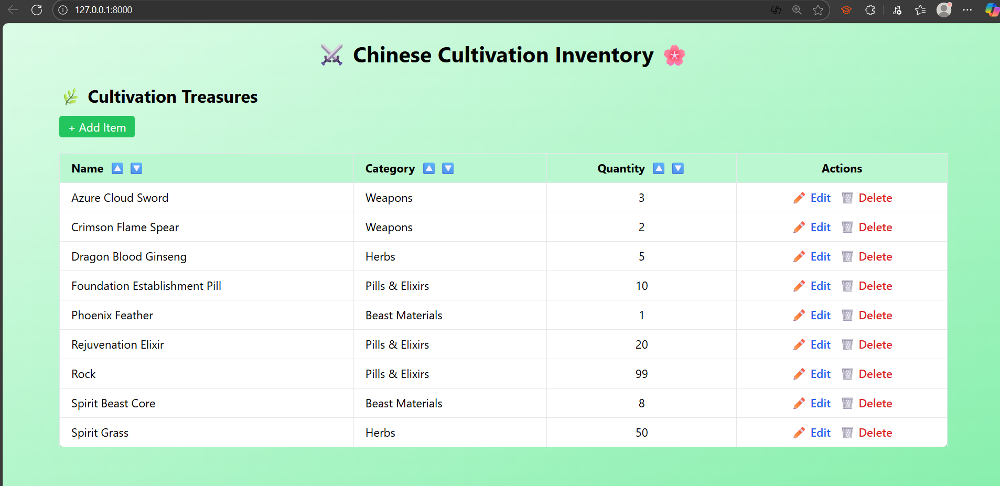

# Project Title
Cultivation Inventory - Midterm Project <br>
By: Eric Brandon B. Gurion

### Description / Overview
The midterm project is about making a working laravel project based on a topic. I chose inventory management and specifically went with a chinese cultivation theme.

### Objectives
1. Download laravel
2. Learn the ins and outs
3. Make the project
4. Present to sir and explain individually.

### Features / Functionality
The system can
- Show existing inventory entries
- add new inventory entries
- delete entries
- sort by category
- edit entries
### Installation Instructions
1. download the file
2. make sure to have the following downloaded: <br>
   a. [laravel](https://laravel.com/docs/12.x/installation) <br>
   b. [xampp](https://www.apachefriends.org/download.html) <br>
   c. [visual studio code](https://code.visualstudio.com/download) <br>
3. open the folder in vsc.
4. go to terminal
5. type `php artisan serve`
6. click the server link
**Done!** You can now access the project

### Usage
- view treasures
- add item
- edit item details
- delete items
- sort category ascending/descending
  
### Screenshots or Code Snippets


.env properties
```
DB_CONNECTION=mysql
DB_HOST=127.0.0.1
DB_PORT=3306
DB_DATABASE=cultivation_inventory
DB_USERNAME=root
DB_PASSWORD=
```

### Contributors
Eric Brandon B. Gurion  
Eric Brandon B. Gurion

### License
git version 2.51.0.windows.1
